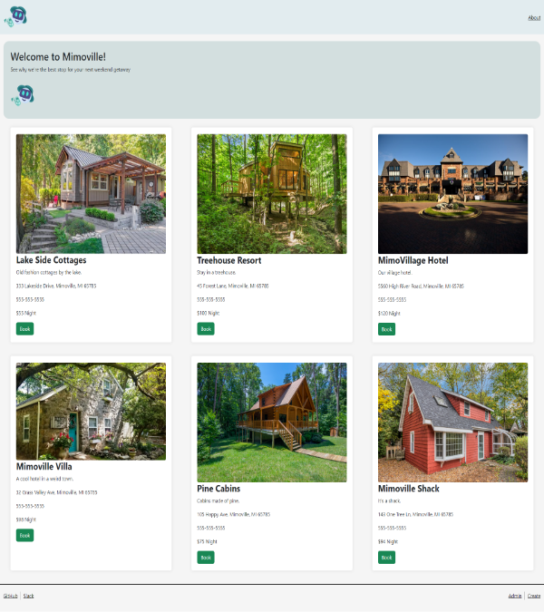

<!-- PROJECT SHIELDS -->
[![Contributors][contributors-shield]][contributors-url]
[![Forks][forks-shield]][forks-url]
[![Stargazers][stars-shield]][stars-url]
[![Issues][issues-shield]][issues-url]
[![MIT License][license-shield]][license-url]
[![LinkedIn][linkedin-shield]][linkedin-url]


<!-- PROJECT LOGO -->
<h3 align="center">Mimoville</h3>

  <p align="center">
    Moc hotel and home rental site in the made up town of Mimoville. Made with React, JavaScript, HTML, CSS, Bootstrap, and deployed on Render.
    <br />
    <a href="https://github.com/Michaelplant2/Mimoville"><strong>Explore the docs »</strong></a>
    <br />
    <br />
    <a href="https://mimoville.onrender.com/">View Demo</a>
    ·
    <a href="https://github.com/Michaelplant2/Mimoville/issues">Report Bug</a>
    ·
    <a href="https://github.com/Michaelplant2/Mimoville/issues">Request Feature</a>
  </p>
</div>


<!-- TABLE OF CONTENTS -->
<details>
  <summary>Table of Contents</summary>
  <ol>
    <li>
      <a href="#about-the-project">About The Project</a>
      <ul>
        <li><a href="#built-with">Built With</a></li>
      </ul>
    </li>
    <li>
      <a href="#getting-started">Getting Started</a>
      <ul>
        <li><a href="#prerequisites">Prerequisites</a></li>
        <li><a href="#installation">Installation</a></li>
      </ul>
    </li>
    <li><a href="#contributing">Contributing</a></li>
    <li><a href="#license">License</a></li>
    <li><a href="#contact">Contact</a></li>
  </ol>
</details>


<!-- ABOUT THE PROJECT -->
## About The Project

<!-- Img of project -->


### Built With

* 
* 
* 
* 
* [![React][React.js]][React-url]
* [![Bootstrap][Bootstrap.com]][Bootstrap-url]

<p align="right">(<a href="#readme">back to top</a>)</p>


<!-- GETTING STARTED -->
## Getting Started

This is an example of how you may give instructions on setting up your project locally.
To get a local copy up and running follow these simple example steps.

### Prerequisites

This is an example of how to list things you need to use the software and how to install them.
* npm
  ```sh
  npm install npm@latest -g
  ```

### Installation

1. Clone the repo
   ```sh
   git clone https://github.com/Michaelplant2/Mimoville.git
   ```
2. Install NPM packages 
   ```sh
   npm install
   ```
3. Start NPM packages
   ```sh
   npm start
   ```

<p align="right">(<a href="#readme">back to top</a>)</p>


<!-- CONTRIBUTING -->
## Contributing
This project was created with help from Cohort-12 of Mimo Dev. 
<br>
**Contributors include:** Kelly, Brandy, Mayte, Rolando, and Gage

Contributions are what make the open source community such an amazing place to learn, inspire, and create. Any contributions you make are **greatly appreciated**.

If you have a suggestion that would make this better, please fork the repo and create a pull request. You can also simply open an issue with the tag "enhancement".
Don't forget to give the project a star! Thanks again!

1. Fork the Project
2. Create your Feature Branch (`git checkout -b feature/AmazingFeature`)
3. Commit your Changes (`git commit -m 'Add some AmazingFeature'`)
4. Push to the Branch (`git push origin feature/AmazingFeature`)
5. Open a Pull Request

<p align="right">(<a href="#readme">back to top</a>)</p>


<!-- LICENSE -->
## License

Distributed under the MIT License.

<p align="right">(<a href="#readme">back to top</a>)</p>


<!-- CONTACT -->
## Contact

Michael Plantamura - MEPlantamura@gmail.com

Project Link: [https://github.com/Michaelplant2/Mimoville](https://github.com/Michaelplant2/Mimoville)

<p align="right">(<a href="#readme">back to top</a>)</p>

<!-- MARKDOWN LINKS & IMAGES -->
<!-- https://www.markdownguide.org/basic-syntax/#reference-style-links -->
[contributors-shield]: https://img.shields.io/github/contributors/Michaelplant2/Mimoville.svg?style=for-the-badge
[contributors-url]: https://github.com/Michaelplant2/Mimoville/graphs/contributors
[forks-shield]: https://img.shields.io/github/forks/Michaelplant2/Mimoville.svg?style=for-the-badge
[forks-url]: https://github.com/Michaelplant2/Mimoville/network/members
[stars-shield]: https://img.shields.io/github/stars/Michaelplant2/Mimoville.svg?style=for-the-badge
[stars-url]: https://github.com/Michaelplant2/Mimoville/stargazers
[issues-shield]: https://img.shields.io/github/issues/Michaelplant2/Mimoville.svg?style=for-the-badge
[issues-url]: https://github.com/Michaelplant2/Mimoville/issues
[license-shield]: https://img.shields.io/github/license/Michaelplant2/Mimoville.svg?style=for-the-badge
[license-url]: https://github.com/Michaelplant2/Mimoville/blob/master/LICENSE.txt
[linkedin-shield]: https://img.shields.io/badge/-LinkedIn-black.svg?style=for-the-badge&logo=linkedin&colorB=555
[linkedin-url]: https://linkedin.com/in/michael-plantamura-458347223/
[product-screenshot]: images/screenshot.png
[Next.js]: https://img.shields.io/badge/next.js-000000?style=for-the-badge&logo=nextdotjs&logoColor=white
[Next-url]: https://nextjs.org/
[React.js]: https://img.shields.io/badge/React-20232A?style=for-the-badge&logo=react&logoColor=61DAFB
[React-url]: https://reactjs.org/
[Vue.js]: https://img.shields.io/badge/Vue.js-35495E?style=for-the-badge&logo=vuedotjs&logoColor=4FC08D
[Vue-url]: https://vuejs.org/
[Angular.io]: https://img.shields.io/badge/Angular-DD0031?style=for-the-badge&logo=angular&logoColor=white
[Angular-url]: https://angular.io/
[Svelte.dev]: https://img.shields.io/badge/Svelte-4A4A55?style=for-the-badge&logo=svelte&logoColor=FF3E00
[Svelte-url]: https://svelte.dev/
[Laravel.com]: https://img.shields.io/badge/Laravel-FF2D20?style=for-the-badge&logo=laravel&logoColor=white
[Laravel-url]: https://laravel.com
[Bootstrap.com]: https://img.shields.io/badge/Bootstrap-563D7C?style=for-the-badge&logo=bootstrap&logoColor=white
[Bootstrap-url]: https://getbootstrap.com
[JQuery.com]: https://img.shields.io/badge/jQuery-0769AD?style=for-the-badge&logo=jquery&logoColor=white
[JQuery-url]: https://jquery.com 
